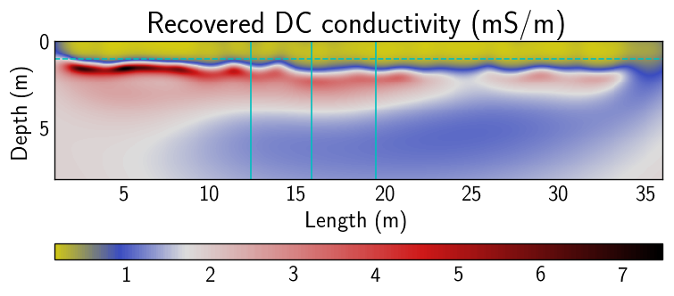
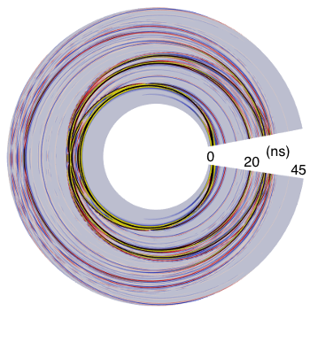

# ⚡ active source

Understanding material properties of the subsurface can help us find energy resources (i.e. oil, gas, geothermal), mitigate hazards, monitor CO2 sequestration sites, understand ground-water flow, map magma chambers and budget water availability.

## 🔰 [Gerjoii](https://github.com/diegozain/gerjoii)

Gerjoii is: forward modeling of ground penetrating **radar** and **electrical resistivity** together with a novel 2.5d joint multi-parameter **inversion algorithm** that recovers electrical **permittivity** and **conductivity** of the subsurface from surface acquired radar and resistivity data. Included is a machine learning routine (PyTorch) for finding the weights needed for the inversion.

For a digested code-tour go [here](https://github.com/diegozain/gerjoii/blob/master/docs/manuals/about/gerjoii-show.pdf), for the code [here](https://github.com/diegozain/gerjoii).

### 🌊 [Wave utils](./gerjoii)

Code suite for processing waveforms as recorded by receivers in the field. Features include: frequency domain filtering, beamforming analysis, frequency time analysis, multichannel analysis of surface waves, and virtual source gathers by seismic interferometry. Lives inside [Gerjoii.](https://github.com/diegozain/gerjoii)

## 🔌⛽ remediation monitoring

Can we find the 3D spread of the remediation agent in the subsurface using DC data? Yes, it is the blue stuff.

On the left is the DCIP instrument used in this survey. On the right is the 3D time-lapse result before and after the injection of the remediation agent. The colored dots denote the location of the injections.

## 🔌 ER 2.5d inversion

[Gerjoii](https://github.com/diegozain/gerjoii) supports 2.5d inversion of ER data. Below is an example of an imaged alluvial aquifer.

Red is where the ground-water is. Yellow is where dry sand lies. Dashed line is a 1m depth marker. Solid lines are borehole locations.

## 🌳 radar on trees

Forward modeling of radar on trees. _Left_ is the wavefield in the tree and _right_ is the observed data.

## 👻 finding graves

Every black dot represents a known grave marker from the image on the left.

