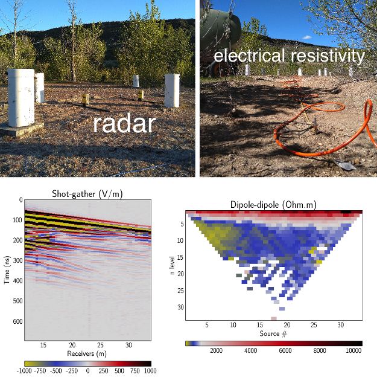

## active source

Understanding material properties of the subsurface can help us find energy resources (i.e. oil, gas, geothermal), mitigate hazards, monitor CO2 sequestration sites, understand ground-water flow, map magma chambers and budget water availability.

### **[Gerjoii](./gerjoii)**

Forward modeling of ground penetrating **radar** and **electrical resistivity** together with a novel 2.5d joint multi-parameter **inversion algorithm** that recovers electrical **permittivity** and **conductivity** of the subsurface from surface acquired radar and resistivity data. Included is a machine learning routine (PyTorch) for finding the weights needed for the inversion. [Code.](https://github.com/diegozain/gerjoii)

### **[Wave utils](./gerjoii)**

Code suite for processing waveforms as recorded by receivers in the field. Features include: frequency domain filtering, beamforming analysis, frequency time analysis, multichannel analysis of surface waves, and virtual source gathers by seismic interferometry. Lives inside [Gerjoii.](https://github.com/diegozain/gerjoii)

