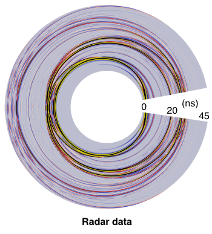

## [Gerjoii](https://github.com/diegozain/gerjoii)

Gerjoii is: forward modeling of ground penetrating **radar** and **electrical resistivity** together with a novel 2.5d joint multi-parameter **inversion algorithm** that recovers electrical **permittivity** and **conductivity** of the subsurface from surface acquired radar and resistivity data. Included is a machine learning routine (PyTorch) for finding the weights needed for the inversion.

Understanding material properties of the subsurface can help us find energy resources (i.e. oil, gas, geothermal), mitigate hazards, monitor CO2 sequestration sites, understand ground-water flow, map magma chambers and budget water availability.

For a digested code-tour go [here](https://github.com/diegozain/gerjoii/blob/master/docs/manuals/about/gerjoii-show.pdf), for the code [here](https://github.com/diegozain/gerjoii).

# ER 2.5d inversion

Supports 2.5d inversion of ER data. Below is an example of an imaged alluvial aquifer. 

Red is where the ground-water is. Yellow is where dry sand lies. Dashed line is a 1m depth marker. Solid lines are borehole locations.

# Radar on trees

Forward modeling of radar on trees. _Left_ is the wavefield in the tree and _right_ is the observed data.

# Finding graves

Every black dot represents a known grave marker from the image on the left.

