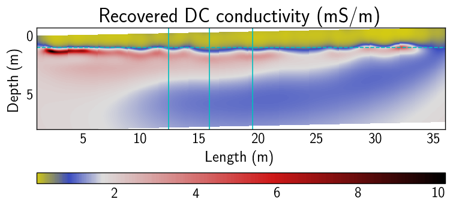

## [Gerjoii](https://github.com/diegozain/gerjoii)

Forward modeling of ground penetrating **radar** and **electrical resistivity** together with a novel 2.5d joint multi-parameter **inversion algorithm** that recovers electrical **permittivity** and **conductivity** of the subsurface from surface acquired radar and resistivity data. Included is a machine learning routine (PyTorch) for finding the weights needed for the inversion.

# Radar on trees

Forward modeling of radar on trees.

# ER 2.5d inversion

Supports 2.5d inversion of ER data.
Below is an example of an imaged alluvial aquifer. Red is where the ground-water is. Yellow is where dry sand lies. Dashed line is a 1m depth marker. Solid lines are borehole locations.

