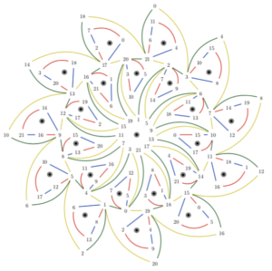
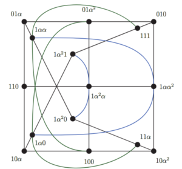
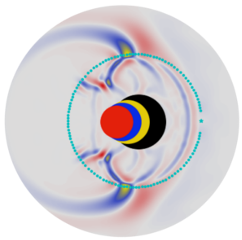

[code!](https://github.com/diegozain/)

# My thing

I am currently a post-doc fellow at Colorado School of Mines in the [Geophysics Department](https://cwp.mines.edu/faculty/). 

I am interested in applying physics, mathematics and high performance computing for the betterment of humanity and exploration of reality. I hold a Master in Mathematics and a PhD in Geophysics. Read more about it in my **[curriculum vitae](./diego-cv.pdf)** and my **[resume](./resume.pdf)**.

During my [PhD](https://scholarworks.boisestate.edu/td/1642/) I developed a non-linear optimization method for high-resolution imaging of the subsurface by joining two different types of electromagnetic surface-acquired data. [Previous interests](https://digitalcommons.mtu.edu/cgi/viewcontent.cgi?article=1806&context=etds) include graph theory, error correcting codes, finite geometries and combinatorics.

 

## Imaging the subsurface

My PhD was about __ground penetrating radar and electrical resistivity high resolution joint inversion__ - [code](https://github.com/diegozain/active-source), [webpage](./gerjoii)

High-resolution non-invasive electrical methods for imaging the shallow subsurface are beneficial for Humanity. They shed light on subsurface energy resources (i.e. oil, gas, geothermal), monitor CO2 sequestration sites and understand ground-water flow.

[Joint inversion of GPR and ER data](https://library.seg.org/doi/10.1190/segam2018-2997794.1), __Diego Domenzain, John Bradford, and Jodi Mead__. SEG Technical Program Expanded Abstracts 2018.

## Media coverage

[Here](https://www.boisestatepublicradio.org/post/boise-state-students-search-bodies-old-idaho-pen#stream/0) is a radio interview about finding graves at the [Old Idaho Penitentiary](https://history.idaho.gov/location/old-penitentiary/), which is also covered [here](https://www.boisestate.edu/news/2019/03/05/geophysics-club-works-to-help-solve-mysteries-in-historic-boise-cemetery/) and [here](./gerjoii).

[Here](https://focus.boisestate.edu/article/ph-d-in-geophysics/) I talk about how you don't need to know about rocks to do geophysics.

