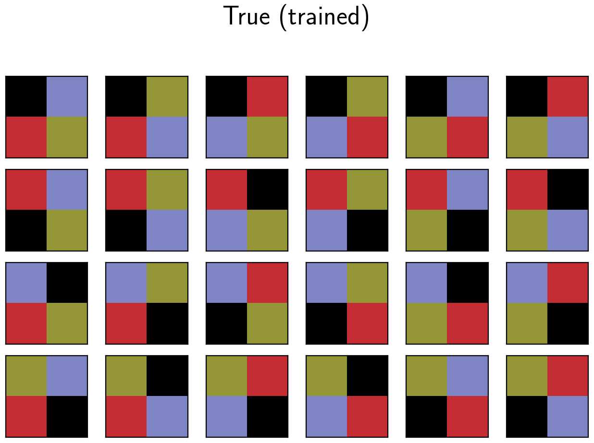
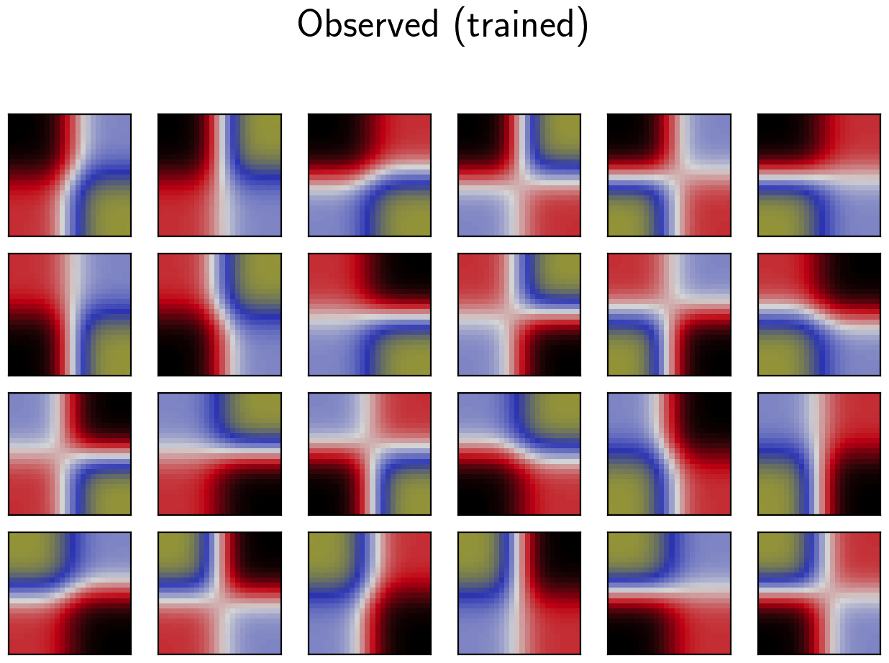
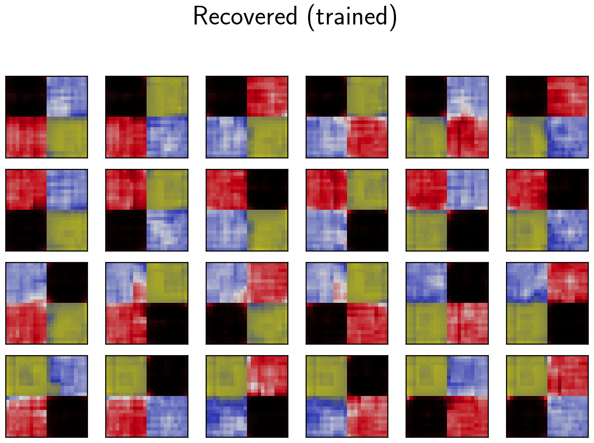
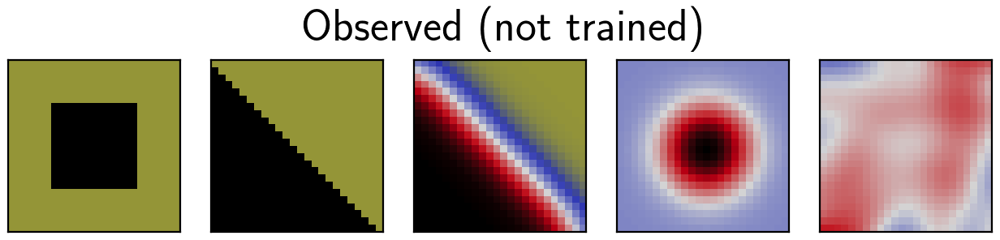
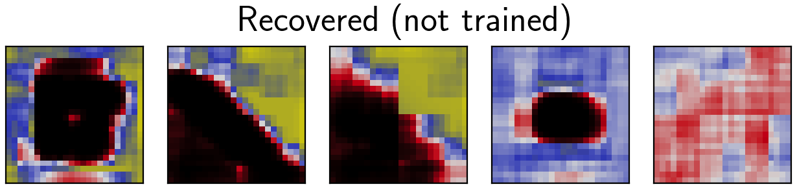

## deep learning

1. Can we find the least number of examples possible for training a deep learning network?

1. How can deep learning benefit exploration geophysics?

1. Is deep learning worth the effort over physics-based methods?

### Enhancement of physics-based methods

This _toy problem_ explores questions No. 1 and No. 2, without trying to substitute physics with deep learning. The code is [here](https://github.com/diegozain/alles/tree/master/projects/deep-learning/pic2pic).

Imagine we have a physics-based inversion result of the subsurface. Can we make it more accurate?

Let the _true_ subsurface look like Figure 1, and our _recovered_ subsurface with physics-based methods look like Figure 2.

Figure 3 shows the _enhanced_ subsurface results.

We only used 24 training subsurface models. Can we use this _learning machine_ on other subsurface models?

Figure 4 shows subsurface models that were not used during training. Figure 5 shows the recovered models from the _learning machine_.

---